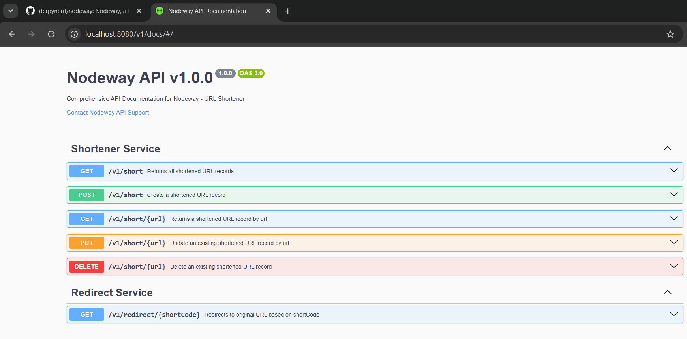
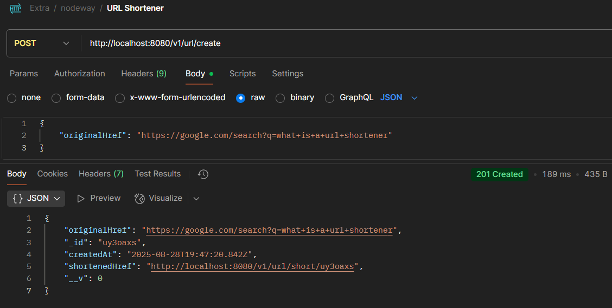
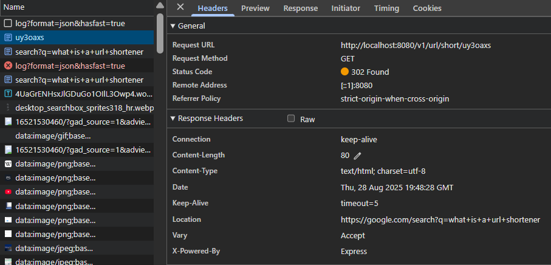

# nodeway
URL Shortener - Generate shortened URLs for any URL

### Specification (version 1.0.0) -

### Flow - 
Generate shortened URL -> Navigate to shortened URL -> Redirected to original URL

### Example -

### Goals - 
- Incorporate redis for caching 
- Improve short code generation logic (hashing?)
- ~~Add duplication checks, null-checks & common error handling~~
- Get rid of "__v" field & fix field ordering in response
- URL encoding before short code generation
- Request header validation?
- ~~Add OpenAPI swagger support~~
- Add CORS handling at application level
- Enhance controller/service logic to match swagger specification
- Add sample request/response & mandatory fields to swagger spec
- Fix nonworking docker-compose watch configuration